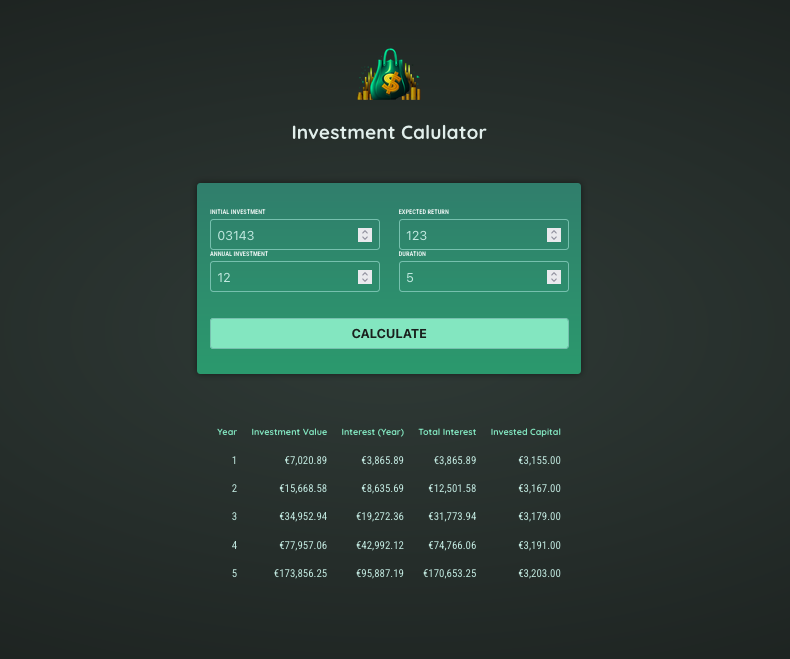

# Investment Calculator

A single-page Angular app that projects how an investment grows over time. Enter your starting amount, expected annual return, yearly contributions, and duration, then view a year-by-year breakdown of value, interest, and invested capital.



## Features

- **Input form** — initial investment, expected return (%), annual investment, and duration (years)
- **Yearly results table** — investment value, interest for the year, total interest, and invested capital
- **Reactive state** — results driven by Angular signals via a shared `InvestmentService`

## Tech stack

- [Angular](https://angular.dev/) 18
- TypeScript
- Angular Forms (template-driven inputs)
- CSS (component-scoped styles)

## Getting started

### Prerequisites

- [Node.js](https://nodejs.org/) (LTS recommended)
- npm (included with Node.js)

### Install dependencies

```bash
npm install
```

### Run the development server

```bash
npm start
```

Open [http://localhost:4200/](http://localhost:4200/). The app reloads when you change source files.

### Build for production

```bash
npm run build
```

Output is written to `dist/essentials-practice/`.

### Run unit tests

```bash
npm test
```

## Project structure

```
src/app/
├── header/                 # Logo and title
├── user-input/             # Investment parameters form
├── investment-results/     # Results table
├── investment.service.ts   # Compound-growth calculation
├── investment-input.modal.ts
└── investment-results.modal.ts
```

Static assets (logo, screenshot) live in `public/`.

## How calculations work

For each year, the app:

1. Computes interest on the current balance: `balance × (expectedReturn / 100)`
2. Adds that interest plus the annual investment to the balance
3. Derives cumulative total interest and total amount invested for the table

## Scripts

| Command        | Description              |
| -------------- | ------------------------ |
| `npm start`    | Start dev server         |
| `npm run build`| Production build         |
| `npm test`     | Run Karma unit tests     |
| `npm run watch`| Build in watch mode      |

## License

This project is for learning and practice purposes.
